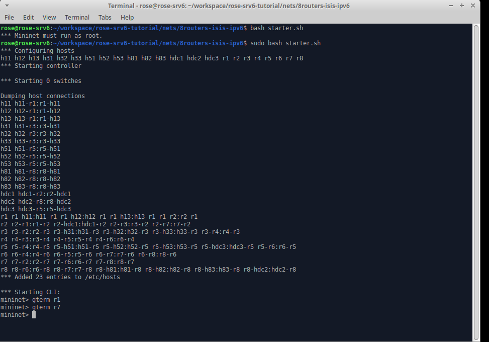
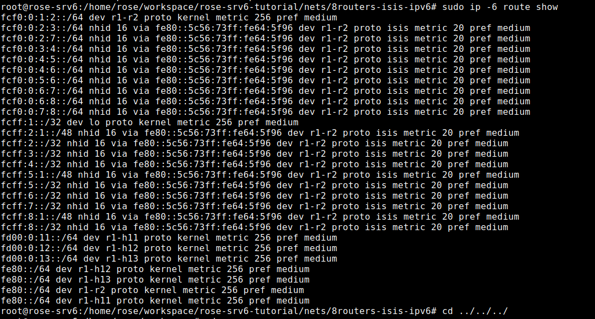
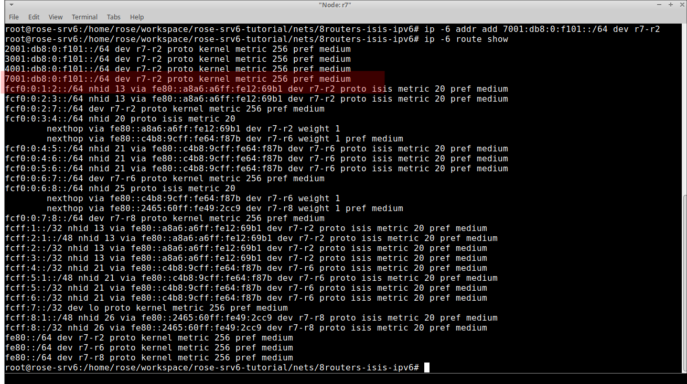
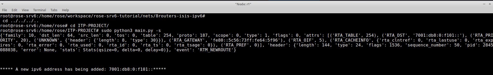

# ITP-PROJECT

## Obiettivo 

Realizzazione di un listener in python per eventi-kernel di routing. 

## Installazione 

1. installare .ova Rose-SRv6 VM su Virtualbox 
2. Installare pyroute2 eseguendo il comando `sudo apt install python3-pyroute2` 
    - il software scritto in python fa uso della libreria pyroute2 per implementare il listener 
3. eseguire il tutorial al [link](https://docs.google.com/document/d/18bVMeJ9SHgaFQwcIPgBOWBgP6ayUpyNNFNqRL0MhWgo/edit#)
    - i test effettuati fanno riferimento alla topologia illustrata nel tutorial indicato
4. fare git clone [github-repo](https://github.com/titianaMannu/ITP-PROJECT.git)

## Stuttura 

Lo script in python contiene 2 funzioni principali: 
- `sniffing_func()`
- `add_ipv6(address, interface)`

entrambe sfruttano la libreria pyroute2 rispettivamente per implementare il listener e per aggiungere un nuovo indirizzo ipv6.

### Modalità d'uso

- `~$ sudo python3 main.py -s` : per far partire il listener. Dal momento in cui esso sarà attivo si metterà in ascolto di TUTTI gli eventi di routing
ma stamperà in modo formattato solamente gli indirizzi corrispondenti agli eventi `RTM_NEWADDR` e `RTM_NEWROUTE`.
 
  - e. g. `***** A new ipv6 address has being added: 2001:db8:0:f101::5*****`

- `~$ sudo python3 main.py -a 2001:0db8:0:f101::1/64 eth0` : per aggiungere un ipv6 ad eth0 (: deve essere inerfaccia valida). 
Il medesimo effetto si può ottenere eseguendo `~$ sudo ip -6 addr add 2001:0db8:0:f101::1/64 dev eth0`.
  

## Tutorial & Test

Si esegue il tutorial: 
`~$ cd ~/workspace/rose-srv6-tutorial/nets/8routers-isis-ipv6/`
`~$ sudo bash starter.sh`
ed i comandi successivi anche se per il funzionamento del listener bastano questi 2.

Successivamente si esegue: 
- `mininet>  gterm r1`
- `mininet> gterm r7`

per far partire i 2 terminali. 

Su r1 : `sudo ip -6 route show `

Su r1 viene fatto partire il listener: 
- aprire terminale in ITP-PROJECT
- eseguire: `sudo python3 main.py -s`

il listener resterà in attesa di nuovi eventi.

Su r7 eseguire: `~$ sudo ip -6 addr add 7001:db8:0:f101::/64 dev r7-r2`.
e `~$ sudo ip -6 route show`

  
Dopo aver inserito il nuovo indirizzo si avrà un aggiornamento anche in r1 ed il listener stamperà un info relativa alla nuova rotta.

`***** A new ipv6 address has being added:  7001:db8:0:f101::*****`
