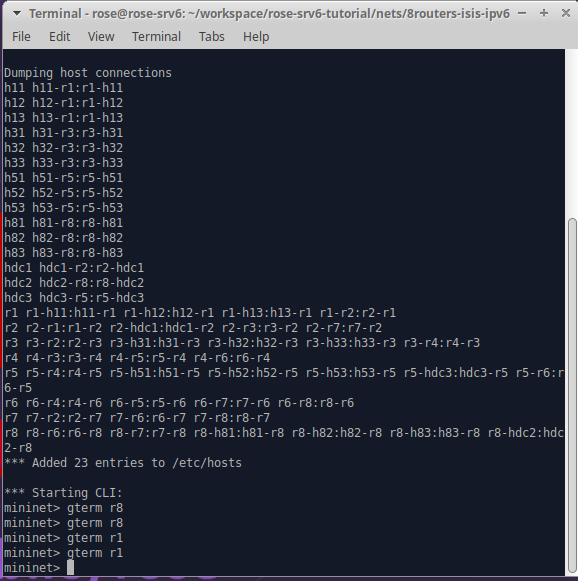
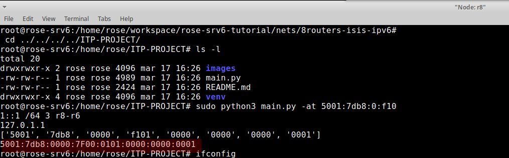
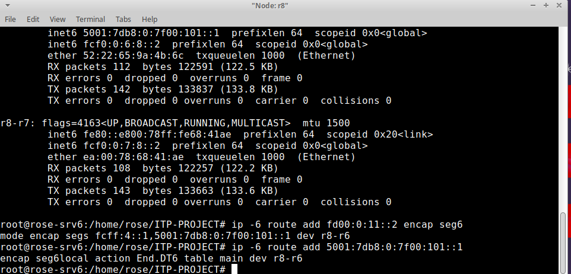
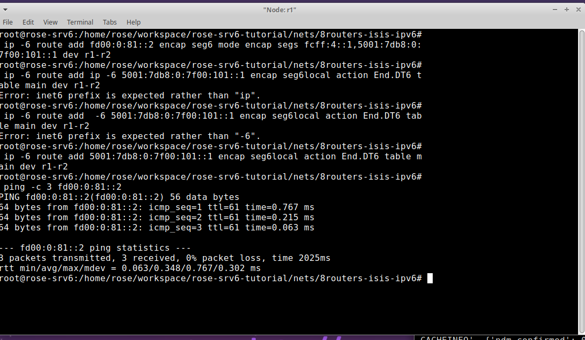
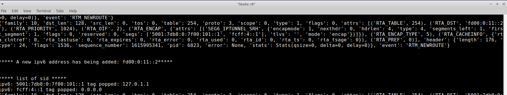
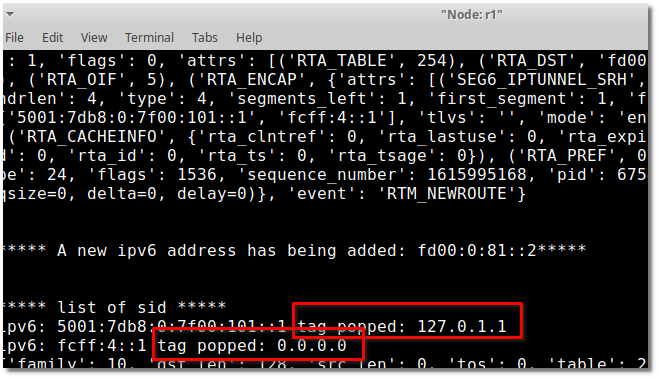

# ITP-PROJECT

## Obiettivo 

Realizzazione di un listener in python per eventi-kernel di routing e creazione di segmenti con sid associati a dei tag. 

Nello specifico è stata inserita l'informazione relativa agli ipv4. Il codice prodotto è ampliabile a tag più generici visto che 
vengono inseriti dei bytes nell'ipv6 in determinate posizioni configurabili.

## Installazione 

1. installare .ova Rose-SRv6 VM su Virtualbox 
2. Installare pyroute2 eseguendo il comando `sudo apt install python3-pyroute2` 
    - il software scritto in python fa uso della libreria pyroute2 per implementare il listener 
3. eseguire il tutorial al [link](https://docs.google.com/document/d/18bVMeJ9SHgaFQwcIPgBOWBgP6ayUpyNNFNqRL0MhWgo/edit#)
    - i test effettuati fanno riferimento alla topologia illustrata nel tutorial indicato
4. fare git clone [github-repo](https://github.com/titianaMannu/ITP-PROJECT.git)

## Stuttura 

Lo script in python contiene 6 funzioni principali: 

- `sniffing_func()`: 
    - listener di eventi kernel
- `add_ipv6_new(address, interface)`
    - aggiunge un indirizzo ipv6 all'interfaccia specificata senza aggiungere un tag
- `push_tag(ipv6, ipv4, pos_to_replace)`
    - inserisce un tag all'interno dell'indirizzo ipv6
- `pop_tag(ipv6, pos_to_replace)`
    - estrapola il tag dall'indirizzo ipv6
- `insert_ipv6_with_tag(ipv6, prefix, pos_to_replace, interface)`
    - aggiunge un indirizzo ipv6 all'interfaccia specificata aggiungendo un tag
- `main()`

### Modalità d'uso

- `~$ sudo python3 main.py -s` : per far partire il listener. Dal momento in cui esso sarà attivo si metterà in ascolto di TUTTI gli eventi di routing
ma stamperà in modo formattato solamente gli indirizzi corrispondenti agli eventi `RTM_NEWADDR` e `RTM_NEWROUTE`.
 
  - e. g. `***** A new ipv6 address has being added: 2001:db8:0:f101::5*****`

- `~$ sudo python3 main.py -a 2001:0db8:0:f101::1/64 eth0` : per aggiungere un ipv6 ad eth0 (: deve essere inerfaccia valida). 
Il medesimo effetto si può ottenere eseguendo`~$ sudo ip -6 addr add 2001:0db8:0:f101::1/64 dev eth0`.
  
  
- `~$ sudo python3 main.py -at 2001:0db8:0:f101::1 /64 4 eth0`: per aggiungere un ipv6 con tag. In particolare il tag 
nell'implementazione corrente corrisponde a ipv4 del nodo corrente nella forma esadecimale "xxxx:yyyy". Questi 4 bytes 
  vanno a sostituire il quartetto dell'ipv6 nella posizione indicata (= 4) e in quella successiva (= 5).
  
    - e. g. fare push 2001:0db8:0:f101::1 4
    - 192.168.0.19 -> C0A8:0013 -> 2001:db8:0:f101:c0a8:13:0:1   prefixlen 64
    - in questo modo il tag viene inserito dove si aveva informazione nulla 0000:0000
    - tuttavia per come è implementato si potrebbe andare a sostituire due qualunque dei "quartetti"

  

## Tutorial & Test

Si esegue il tutorial: 
`~$ cd ~/workspace/rose-srv6-tutorial/nets/8routers-isis-ipv6/`
`~$ sudo bash starter.sh`

Successivamente si esegue: 
- `mininet>  gterm r1`
- `mininet>  gterm r1`
- `mininet> gterm r8`
- `mininet>  gterm r8`

per far partire 4 terminali e poi spostarsi sulla cartella ITP-PROJECT dove è stato clonato il repo. 

Su un terminale r1 si fa partire il listener: `sudo python3 main.py -s`

Su un terminale r8 si fa partire il listener: `sudo python3 main.py -s`

In questo modo i due nodi sono in ascolto!

Sul secondo terminale r8 si aggiunge un tagged-ipv6 con il seguente comando:
`~$ sudo python3 main.py -at 5001:7db8:0:f101::1 /64 3 r8-r6`

Come si può vedere l'indirizzo che viene inserito è stato modificato inserendo un tag.

A questo punto si inserisce una rotta seguendo il [tutorial](https://docs.google.com/document/d/18bVMeJ9SHgaFQwcIPgBOWBgP6ayUpyNNFNqRL0MhWgo/edit#)
modificando i parametri in modo adeguato per adattarlo al nostro caso di studio.

Sul nodo r8:
- `~# ip -6 route add fd00:0:11::2 encap seg6 mode encap segs fcff:4::1,5001:7db8:0:7f00:101::1 dev r8-r6`

- `~# ip -6 route add 5001:7db8:0:7f00:101::1 encap seg6local action End.DT6 table main dev r8-r6`

Sul nodo r1: 
- `~# ip -6 route add fd00:0:81::2 encap seg6 mode encap segs fcff:4::1,5001:7db8:0:
7f00:101::1 dev r1-r2`

- `~# ip -6 route add 5001:7db8:0:7f00:101::1 encap seg6local action End.DT6 table m
ain dev r1-r2`

Dopo aver aggiornato le rotte i listener che avevamo fatto partire sugli altri 2 terminali avranno rilevato 
il cambiamento e stampato dei risultati.
È stato effettuato anche il ping per controllare che il canale fosse stabilito in modo corretto.

A seguito dell'aggiunta di nuove rotte entrambi i listener hanno stampato informazioni analoghe.
In particolare il tag che avevamo inserito è stato riconosciuto (p.s. Il test effettuato su nodo locale usa localhost
ma se si prova ad inserire tagged-ip su macchina fisica e non virtuale ad esempio potrebbe essere stampato: 192.168.0.19).
****
Per l'altro indirizzo del SID viene stampato 0.0.0.0 in quanto non avevamo inserito il tag per esso.